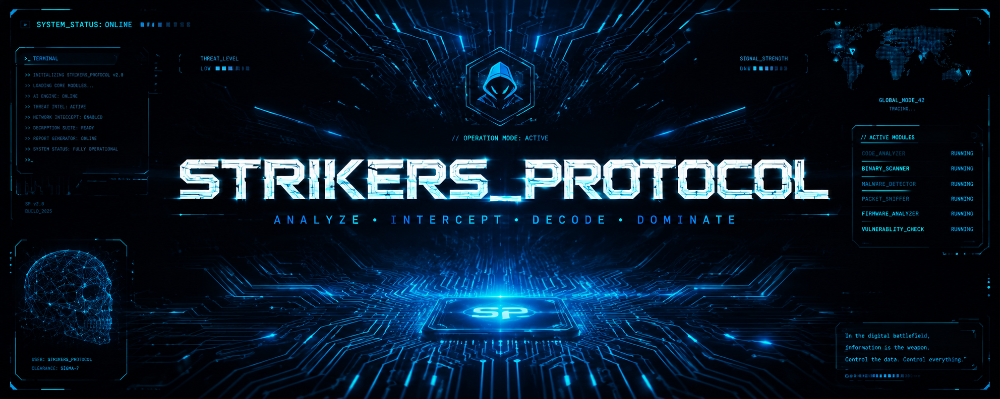

<div align="center">



# ⚡ STRIKERS_PROTOCOL v2.0 ⚡

**Universal Reverse Engineering Intelligence Platform**

[](#)
[](#)
[](#)
[](#)
[](LICENSE)

*Analyze • Intercept • Decode • Dominate*

---
</div>

## What It Does

Drop **any** file or description → get full intelligence:
- **Components identified** — every library, chip, protocol, algorithm
- **Logic & execution flow** — step-by-step breakdown
- **Security audit** — vulnerabilities with severity ratings
- **Bug detection** — root cause analysis
- **PDF report** — downloadable professional report

**Supported targets:**

| Target | Formats |
|--------|---------|
| Software / App | APK, EXE, DLL, SO, any binary |
| Firmware / IoT | BIN, HEX, Flipper Zero, Arduino |
| Hardware | PCB, HDD, Keyboard (describe it) |
| Source Code | Any language — paste directly |
| Network / Protocol | PCAP, packet logs, hex dumps |

---

## Quick Start

### Windows

```cmd
Double-click START_WINDOWS.bat
```

It will auto-install everything and open your browser.

### Linux / Mac

```bash
chmod +x start.sh
./start.sh
```

### Manual Setup

```bash
# 1. Clone / extract project
cd strikers_protocol

# 2. Create virtual environment
python3 -m venv venv
source venv/bin/activate        # Linux/Mac
# OR: venv\Scripts\activate     # Windows

# 3. Install dependencies
pip install -r requirements.txt

# 4. Configure environment
cp .env.example .env
# Open .env and set GROQ_API_KEY

# 5. Start server
python -m uvicorn main:app --host 127.0.0.1 --port 8000 --reload

# 6. Open browser
# http://localhost:8000
```

---

## Configuration (.env)

```
GROQ_API_KEY=gsk_...            # Required — get from console.groq.com
SECRET_KEY=change_this          # JWT secret — change to any random string
APP_PORT=8000                   # Port (default 8000)
MAX_UPLOAD_SIZE_MB=50           # Max file upload size
```

---

## Project Structure

```
strikers_protocol/
│
├── main.py                         # FastAPI app entry point
├── requirements.txt                # Python dependencies
├── .env.example                    # Config template
├── START_WINDOWS.bat               # Windows one-click start
├── start.sh                        # Linux/Mac one-click start
│
├── backend/
│   ├── routers/
│   │   ├── auth.py                 # /api/auth/* — login, register
│   │   └── analysis.py             # /api/analysis/* — run, history, PDF
│   │
│   ├── services/
│   │   ├── ai_service.py           # Groq API integration
│   │   ├── file_analyzer.py        # Binary parsing — PE, ELF, APK, HEX
│   │   └── pdf_service.py          # PDF report generation
│   │
│   ├── models/
│   │   ├── db_models.py            # SQLAlchemy ORM models
│   │   └── schemas.py              # Pydantic request/response schemas
│   │
│   └── utils/
│       ├── database.py             # Async SQLite setup
│       └── auth.py                 # JWT authentication
│
├── frontend/
│   └── templates/
│       └── index.html              # Full SPA frontend
│
├── uploads/                        # Uploaded files (auto-created)
├── reports/                        # Generated PDF reports (auto-created)
└── data/                           # SQLite database (auto-created)
```

---

## API Endpoints

| Method | Endpoint | Description |
|--------|----------|-------------|
| POST | `/api/auth/register` | Create account |
| POST | `/api/auth/login` | Login, get JWT token |
| GET | `/api/auth/me` | Current user info |
| POST | `/api/analysis/run` | Run analysis (multipart form) |
| GET | `/api/analysis/history` | Your analysis history |
| GET | `/api/analysis/{id}` | Get specific analysis |
| GET | `/api/analysis/{id}/pdf` | Download PDF report |
| DELETE | `/api/analysis/{id}` | Delete analysis |

Full interactive docs: `http://localhost:8000/api/docs`

---

## 🛠️ Tech Stack

| Layer | Technology |
|-------|-----------|
| Frontend | React (Modern UI) |
| Backend | Python 3.10+ / FastAPI |
| Database | SQLite (async via aiosqlite) |
| Auth | JWT (python-jose + bcrypt) |
| AI Engine | Groq AI (Behavioral analysis) |
| PDF | fpdf2 |
| Binary parsing | Pure Python (struct, zipfile, re) |

## Requirements

- Python 3.10 or newer
- Groq API key (get one at console.groq.com)
- Internet connection (for AI analysis)
- ~100MB disk space

---

<div align="center">

**STRIKERS_PROTOCOL // FOR SECURITY RESEARCH & LEARNING ONLY**

</div>
